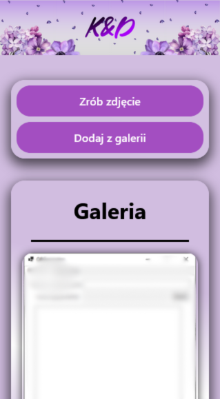
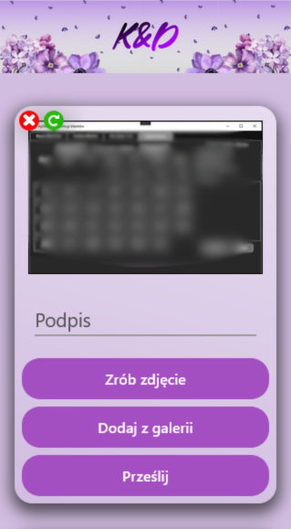
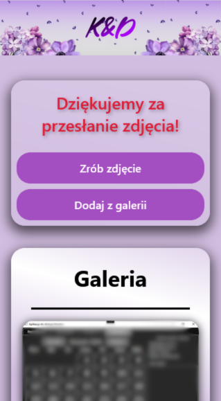
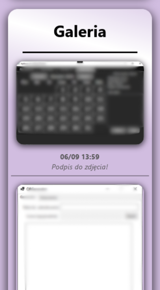
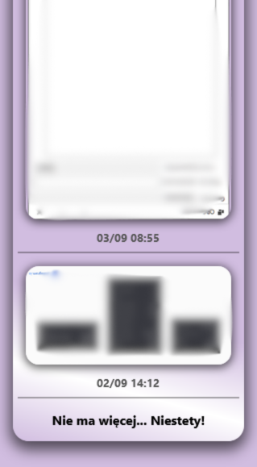
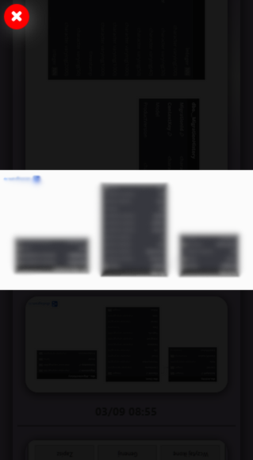
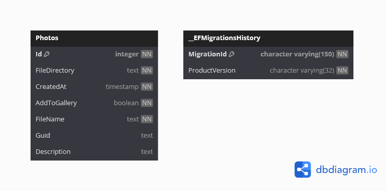
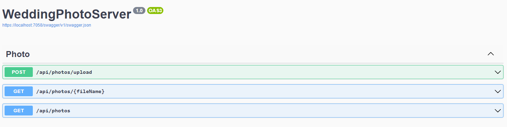

# WeddingPhotoApp

## 📋 Description

WeddingPhotoApp is a client-server web application designed for uploading and sharing photos in a public gallery. Guests at a wedding can upload their photos to the gallery, which can then be viewed by all participants. Users can upload, rotate, and caption their photos. The application features pagination, loading the 10 most recent photos at a time, with additional photos being loaded dynamically as the user scrolls.

## ✨ Features

- **Photo Upload**: Users can upload photos to a public gallery.
- **Photo Manipulation**: Users can rotate photos and add captions before uploading.
- **Public Gallery**: Photos are available for viewing by all wedding participants.
- **Pagination**: The gallery uses pagination to load the 10 latest photos first. Additional photos are loaded dynamically as the user scrolls through the gallery.
- **Local File Storage**: Uploaded photos are saved locally on the server.

## 🛠️ Technologies

- **ASP.NET Core**: Backend API built on .NET Core.
- **React**: Frontend developed using React for a dynamic user interface.
- **Entity Framework (EF)**: Object-relational mapper (ORM) for interacting with the PostgreSQL database.
- **PostgreSQL**: Relational database management system for storing metadata about uploaded photos.
- **Unit Testing**: Tests are written using MSTest.
- **Swagger**: API documentation and testing interface.

## 🏗️ Architecture

The application follows a layered architecture pattern, separating responsibilities into distinct layers for maintainability and scalability:

- **Repository Layer**: Handles database interactions through Entity Framework.
- **DTO (Data Transfer Objects)**: Used to transfer data between the backend and frontend.
- **Models**: Represent the data structures in the application.
- **Services**: Contain business logic.
- **Controllers**: Manage API requests and handle communication between the frontend and backend.

## 📂 Application

Below are screenshots demonstrating the core functionality and user interface of the WeddingPhotoApp.

     

## 🗂️ Database Model

The following diagram represents the database model used in the application.



## 📑 API Documentation

The WeddingPhotoApp API is fully documented using Swagger. All API endpoints can be explored and tested directly through the Swagger UI.



To access the Swagger UI, navigate to:

    http://localhost:7058/swagger


## 🚀 Installation

1. **Clone the repository**

    Clone the repository to your local machine by running the following command:
    ```bash
    git clone https://github.com/your-repo/WeddingPhotoApp.git
    ```

2. **Backend (ASP.NET Core) Setup**

    - Ensure that .NET Core SDK is installed.
    - Navigate to the WeddingPhotoApp.Api project directory.
    - Update the appsettings.json with your PostgreSQL database connection string.
    - Run the following commands to build and run the backend:
      ```bash
      dotnet restore
      dotnet build
      dotnet run
      ```
3. **Frontend (React) Setup**

    - Ensure that Node.js and npm are installed.
    - Navigate to the WeddingPhotoApp.Client directory.
    - Install the necessary dependencies:
      ```bash
      npm install
      ```
    - Start the React development server:
      ```bash
      npm start
      ```

4. **Create the PostgreSQL Database**

   Use the Entity Framework migration commands to create the database schema in PostgreSQL:
   ```bash
   dotnet ef database update
   ```
   
6. **Configure the Database Connection**

   Update the PostgreSQL database connection string in the appsettings.json file to point to your newly created database.


## ✅ Testing

The application includes 27 unit tests. To execute the tests:

- Open the solution in Visual Studio.
- Open the Test Explorer from the Test menu.
- Click Run All to execute all tests.


## 📄 License

The application is available under the MIT License. See the LICENSE file for details.
